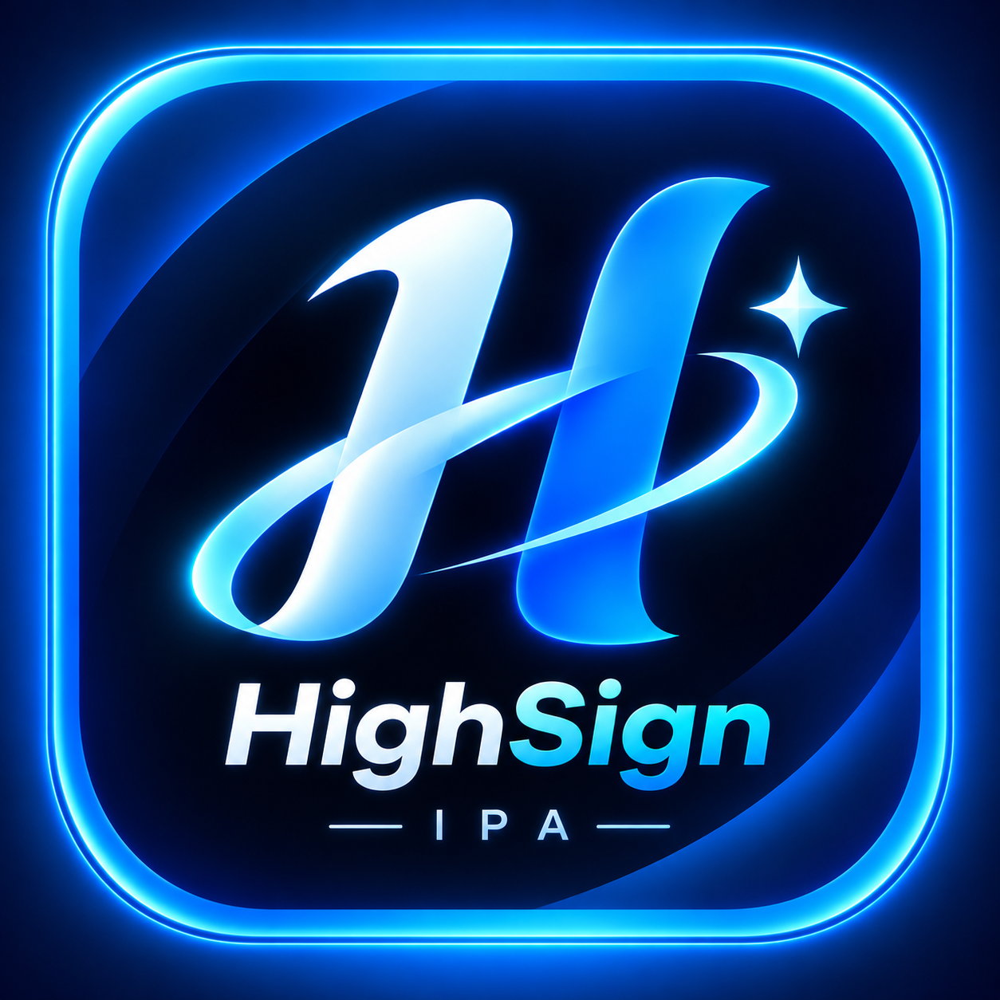

# HighSign

  

  <b>Trình ký ứng dụng iOS Siêu Tốc & Quản lý IPA Tối Ưu</b> 
  <i>Nhanh hơn • Mượt hơn • Tối ưu bộ nhớ máy tối đa</i>

---

## ⚡ Ưu điểm vượt trội của HighSign

- 🚀 **Ký siêu tốc (Ultra-Fast Signing)**: Tối ưu hoá toàn bộ tiến trình đóng gói và ký IPA với tốc độ siêu nhanh (chỉ mất 1-2 giây), vượt trội hoàn toàn so với Ksign và các công cụ ký khác trên thị trường.
- 🔒 **Mặc định Server Localhost nội bộ**: Sử dụng 100% server nội bộ trên thiết bị, tuyệt đối không bắt qua server trung gian bên ngoài, đảm bảo tính riêng tư, bảo mật và tốc độ tức thì.
- 🧹 **Tự động dọn dẹp file & Tối ưu máy**: Tích hợp tính năng dọn dẹp chuyên sâu 1 chạm và tự động xóa toàn bộ file tạm/dữ liệu thừa sau khi cài đặt app, trả lại 100% dung lượng trống cho thiết bị.
- 🎨 **Giao diện hiện đại**: Bố cục trực quan, biểu tượng neon electric blue sắc nét, hỗ trợ đầy đủ tiếng Việt.

---

## 📦 Cài đặt & Sử dụng

1. Tải bản build mới nhất định dạng `.ipa` từ mục **Releases** hoặc tab **Actions** (Artifacts).
2. Cài đặt trực tiếp qua TrollStore, AltStore, Sideloadly hoặc các công cụ sideload ưa thích của bạn.
3. Thêm chứng chỉ (`.p12` & `.mobileprovision`) và bắt đầu ký app với tốc độ siêu tốc.

---

## 🛠️ Tự động Build IPA qua GitHub Actions

Mỗi khi mã nguồn được cập nhật hoặc kích hoạt thủ công qua workflow dispatch:
- GitHub Actions trên macOS runner sẽ tự động build `HighSign.ipa`.
- File IPA được xuất tự động vào **Artifacts** và phát hành tại **Releases** cho người dùng tải về tức thì.
